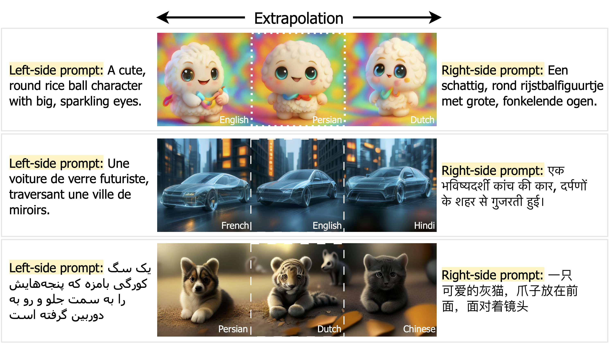

<div align="center">
<br>

<h3>NeoBabel: A Multilingual Open Tower for Visual Generation</h3>

[Mohammad Mahdi Derakhshani](https://mmderakhshani.github.io/)<sup>2</sup>&nbsp;
[Dheeraj Varghese](https://dhevarghese.github.io/)<sup>2</sup>&nbsp;
[Marzieh Fadaee](https://scholar.google.com/citations?hl=en&user=NZqs0toAAAAJ&view_op=list_works&sortby=pubdate)<sup>1</sup>&nbsp;
[Cees G. M. Snoek](https://scholar.google.com/citations?user=0uKdbscAAAAJ&hl=en)<sup>2</sup>&nbsp;


<sup>1</sup> Cohere Lab  <sup>2</sup> University of Amsterdam&nbsp;
 
[](https://arxiv.org/abs/2507.06137) [](https://neo-babel.github.io/)

</div>


## Say 👋 to NeoBabel
NeoBabel is a new multilingual image generation framework that advances performance, efficiency, and inclusivity across six languages. It combines large-scale multilingual pretraining with high-resolution instruction tuning and extends existing benchmarks to evaluate multilingual capabilities. NeoBabel outperforms strong multilingual baselines while maintaining competitive English performance, despite being significantly smaller. It introduces new metrics for evaluating crosslingual alignment and robustness to code-mixed prompts. The framework is fully open, with released models, data, and evaluation tools, demonstrating that multilingualism enhances robustness, efficiency, and cultural relevance in generative AI.

<br/>

## 📋 Release To‑Do List
- ✅ Evaluation suite (`m-GenEval`, `m-DPG`)
- ✅ Multilingual pretraining & instruction tuning datasets
- ✅ Full codebase for pretraining, instruction tuning, and evaluation
- 🔜 Data curation pipeline (translation, recaptioning, filtering)
- 🔜 Final checkpoint of NeoBabel (2B)

## Hugging Face models

🔜 The NeoBabel checkpoints can be found on [Hugging Face](https://huggingface.co/mderakhshani/NeoBabel).

## Getting Started
First, set up the environment:
```
pip install -r requirements.txt
```
Login your wandb account on your machine or server.
```
wandb login <your wandb keys>
```
Inference demo for **Text-to-Image Generation** and you can view the results (in a resolution of 512x512) on wandb.
```
python inference_t2i.py config=configs/eval/neobabel_demo_512x512.yaml \
batch_size=1 validation_prompts_file=validation_prompts/neobablprompts.txt \
guidance_scale=5 generation_timesteps=50 \
mode='t2i'
```


Inference demo for **Multilingual Image Inpainting** and you can view the results (in a resolution of 512x512) on wandb.
```
python inference_t2i.py config=configs/image_editing.yaml \
batch_size=1 \
guidance_scale=1.5 generation_timesteps=25 \
mode='inpainting' prompt='An orange and a bird made of wheat bread.' \
image_path=./multilingual_image_editing/egg_bird.png inpainting_mask_path=./multilingual_image_editing/egg_bird_mask.png
```


Inference demo for **Multilingual Image Extrapolation** and you can view the results (in a resolution of 512x512) on wandb.
```
python inference_t2i.py config=configs/image_editing.yaml \
batch_size=1 \
guidance_scale=7 generation_timesteps=50 \
mode='extrapolation' extra_direction='left *** left *** right *** right' offset=0 prompt='A 3D render of a cute, round rice ball character with big, sparkling eyes. *** A 3D render of a cute, round rice ball character with big, sparkling eyes. *** Een 3D-weergave van een schattig, rond rijstbalfiguurtje met grote, fonkelende ogen. *** Een 3D-weergave van een schattig, rond rijstbalfiguurtje met grote, fonkelende ogen.' \
image_path=./multilingual_image_editing/cute_rice_ball.png
```


## Training pipeline
**Prepare your training data and change the data path in `configs/xx.yaml`.**

Note that, our training process is based on `accelerate`. Please ensure to config your `accelerate` for distributed training. We provide config examples below for (distributed) training on a single GPU or multiple GPUs.
```
├── accelerate_configs/ 
   ├── multi_nodes   (6x4 GPUs or 6x8 GPUs)
   ├── multi_nodes_2 (2x4 GPUs)
   ├── multi_nodes_3 (3x4 GPUs)
   └── single_node   (1x4 GPUs)
```
### Progressive Pretraining
**Stage 1 – Pixel Dependency Learning.** Change the data path to ImageNet-1K in `configs/neobabel_pretraining_stage1.yaml`.
```
accelerate launch --config_file path/to/your/accelerate_config --main_process_port=8888 training/train.py config=configs/neobabel_pretraining_stage1.yaml
```
Once trained, the `checkpoint` folder is structured as follows:
```
├── show-o-training-stage1/ 
   ├── ...
   ├── checkpoint-500000
   └── config.yaml
```
**A bit cumbersome.** Just create a new output folder (edited in the yaml config) for stage 2, copy the latest `checkpoint` of stage 1 to this folder, and rename it to `checkpoint-0`. It will be automatically resumed for next stage training. **Apply same procedures for the `resume` training in the following stages.**
```
├── neobabel-o-training-stage2/ 
   └── checkpoint-0
```
**Stage 2 – Scaling Alignment with Large-Scale Multilingual Data.** The default dataloader is based on `WebDataset`. Change the data path in `configs/neobabel_pretraining_stage2.yaml`.
```
accelerate launch --config_file path/to/your/accelerate_config --main_process_port=8888 training/train.py config=configs/neobabel_pretraining_stage2.yaml
```
**Stage 3 – Refined Multilingual Pretraining.** Change the data path in `configs/neobabel_pretraining_stage3.yaml`
```
accelerate launch --config_file path/to/your/accelerate_config --main_process_port=8888 training/train.py config=configs/neobabel_pretraining_stage3.yaml
```

### Progressive Instruction Tuning
**Stage 1 – Initial Multilingual Instruction Alignment.** Change the data path in `configs/neobabel_instruction_tuning_1.yaml`
```
accelerate launch --config_file path/to/your/accelerate_config --main_process_port=8888 training/train.py config=configs/neobabel_instruction_tuning_1.yaml
```
**Stage 2 – Instruction Refinement.** Change the data path in `configs/neobabel_instruction_tuning_2.yaml`
```
accelerate launch --config_file path/to/your/accelerate_config --main_process_port=8888 training/train.py config=configs/neobabel_instruction_tuning_2.yaml
```

### Citation
To cite the paper and model, please use the below:
```
@article{derakhshani2025neobabel,
  title={NeoBabel: A Multilingual Open Tower for Visual Generation},
  author={Derakhshani, Mohammad Mahdi and Varghese, Dheeraj and Fadaee, Marzieh and Snoek, Cees GM},
  journal={arXiv preprint arXiv:2507.06137},
  year={2025}
}
```
### Acknowledgments
This work is heavily based on [show-o](https://github.com/showlab/Show-o), [open-muse](https://github.com/huggingface/open-muse), [Phi-1.5](https://huggingface.co/microsoft/phi-1_5), [muse-maskgit-pytorch](https://github.com/lucidrains/muse-maskgit-pytorch), [maskgit](https://github.com/google-research/maskgit), [taming-transformers](https://github.com/CompVis/taming-transformers), [transformers](https://github.com/huggingface/transformers), [accelerate](https://github.com/huggingface/accelerate), [diffusers](https://github.com/huggingface/diffusers), and [webdatset](https://github.com/webdataset/webdataset). Thanks to all the authors for their great work.
